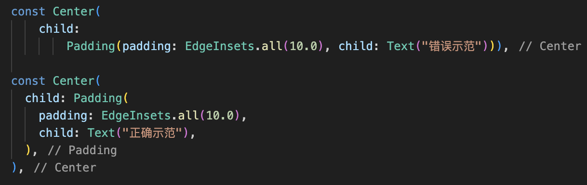

# Flutter 设计百科全书
## Flutter、Dart 的语法和代码编写规范篇

## 前言
我最喜欢的2句话，  
前者是 ”闻道有先后，术业有专攻“  
后者是 ”学无先后，达者为师“  

因为受到这两句话的影响，我这个人也是非常尊重分享知识的人。
同时也因为如此，有时候会跟别人产生争执，讨论某某技术是否足够好。  
但永远围绕的是知识而不是人。但是有些人攻击你，不仅攻击你，还要攻击你的知识。

> ”好为人师一直是我的问题“  
> ”永远不要试图说服每一个人“  
>
> 本章内容充满了个人认知与理解，如果你有不同意见完全可以直接跳过。

## 本章内容
+ 推荐和不推荐的，做法、代码写法和组件
+ 后续

### 推荐和不推荐的，做法、代码写法和组件
* 请给组件增加 const，late 和 final,不要全部属性都使用可空字段，要根据情况来
* 如果你使用vs code，那么你的目标是解决每一个下划线警告和提示。😁
```DART
late id;
const SizedBox();
final pi = 3.1415926;
int? id;
 ```

* 当前类私有字段和函数 用_下划线开头标记
```DART
_pageIndex;
_buildBody()
_initData()
```

* 页面的字段和属性应该是有顺序的
```DART
 // 视图页面
 参数;
 事件和触发函数
 Widget build(BuildContext context)
 Widget _buildList()
 Widget _buildItem()

 // 逻辑页面
 参数;
 oninit()
 _loadData()
 _onTapUserInfo()
```

* 使用debugPrint而不是print(存疑)
```DART
print()❌
debugPrint()✅
```

* 使用绝对路径引入包
```DART
import '../../../routes/app_pages.dart';❌
import 'package:**/routes/app_pages.dart';✅
```


* 明文标记 Future<T> 的返回类型T
```DART
Future<T> work();
```

* 颜色优先使用16进制表达式
```DART
Color(0xFF336699)
```

* 不要愚蠢的设计固定颜色值（Theme 和 颜色设计看我另外的文章）
```DART
  static Color c_FF381F = const Color(0xFFFF381F); ❌
  static Color c_DB3A34 = const Color(0xFFDB3A34); ❌
  static Color c_666666 = const Color(0xFF666666); ❌
  static Color c_999999 = const Color(0xFF999999); ❌
  static Color c_FFFFFF = const Color(0xFFFFFFFF); ❌
  static Color c_18E875 = const Color(0xFF18E875); ❌
  static Color c_F0F2F6 = const Color(0xFFF0F2F6); ❌
```

* 使用DecoratedBox装饰 而不是 Container，除非你还需要使用其他属性
```DART
const Container() ❌

const DecoratedBox() ✅
 ```

* 使用Padding设置边距，而不是 Container
```DART
Container(
      padding: padding) ❌

Padding(
      padding: padding)  ✅
```

* 使用SizedBox占位，而不是 Container
```DART
const Container() ❌

const SizedBox() ✅
```
 

* 尽量不要使用的属性
```DART
double.infinity
```
    一般情况下是不需要明文使用double.infinity的，
    常见的可能会设置double.infinity的情况
    > body 的组件无法铺满，使用SizedBox.expand铺满（内部是double.infinity）

    > Column 无法铺满，设置crossAxisAlignment:CrossAxisAlignment.stretch 左右铺满

    > Row 无法铺满，设置crossAxisAlignment:CrossAxisAlignment.stretch 上下铺满

    > Stack 无法铺满，设置fit: StackFit.expand 铺满

暂时只想到这些组件有铺满问题，所以项目中不需要用到明文的double.infinity。


* 请尽量将属性字段超过2个的逗号补全，增加 代码的可阅读性！！！！


 
* 不要在行内进行复杂运算（固定常量区别不大，它会在编译时被提前运算保存结果）
```DART
SizedBox(height: 3.1415926 * pi * input)  ❌  // 应该将 计算值放到实体类 中
SizedBox(height: 16 / 7) // 可以用，问题不大
```

* 不要滥用的属性
```DART
SafaArea
```
多数情况下，在安卓设计中，沉浸式状态栏都是一种非常漂亮的设计，
如果错误的使用SafeArea会丢失这种效果，
并且有时候SafeArea会导致无法预料的布局，所以谨慎使用。

* 使用枚举来处理业务和显示描述
```DART
 ❌ 错误的示范
 logic.currentGender.value == 1
                  ? xxx
                  : xxx

✅
/// 实名状态
enum Status {
  //已认证
  passed(1),
  //审核中
  submitted(2),
  //审核未通过
  unpassed(3),
  //成功
  successed(4);

  final int code;
  const Status(this.code);

  static Status convert(int code) {
    return Status.values.firstWhere((p) => p.code == code);
  }

  @override
  String toString() {
    switch (this) {
      case Status.passed:
        return "已认证";
      case Status.submitted:
        return "审核中";
      case Status.unpassed:
        return "审核未通过";
      case Status.successed:
        return "成功";
      default:
        return "";
    }
  }
}

// 判断状态
logic.status == Status.successed
                  ? xxx
                  : xxx

// 直接跟源数据类型判断
logic.statusData == Status.successed.code

// 显示状态的描述
Status.convert(4).toString() // 输出成功
```

