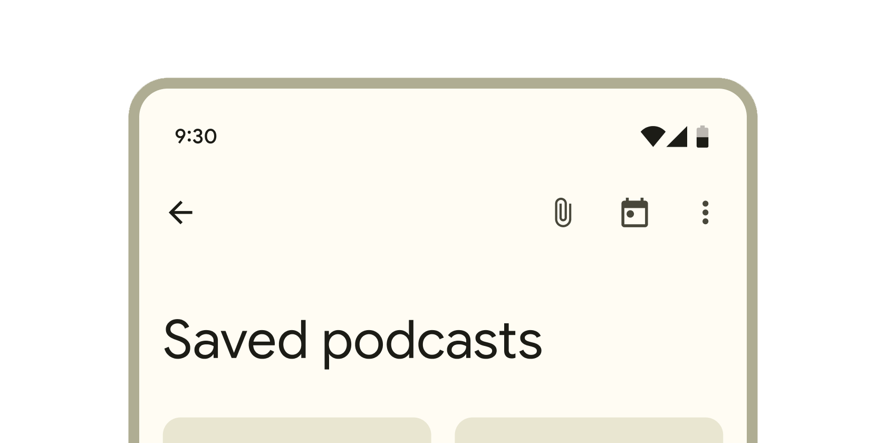

# Flutter 设计百科全书
## Scaffold、AppBar、AppBarTheme、SafeArea和系统状态栏篇

## 前言
本章内容可能在Android 6/7 之前的系统中，有部分不兼容，因为年代久远不做考虑。

## 本章内容
+ Scaffold 脚手架
+ AppBar 和 AppBarTheme
+ SafeArea 安全区域
+ SystemUiOverlayStyle 系统状态栏 和 沉浸式状态栏(透明状态栏) 和 高斯模糊方案
+ 底部导航栏 和 沉浸式导航栏(探索三大金刚)
+ 底部小黑条
+ 系统状态栏和导航栏在部分手机中不兼容问题

## Scaffold 脚手架
> 推荐把Scaffold作为每个页面的基础组件，并为它搭配上AppBar组件。  
> 原因：AppBar中的SystemUiOverlayStyle，是设置手机 系统状态栏和系统导航栏的重要属性。如果不增加该配置，状态栏跟页面颜色可能会冲突  
> 不推荐Scaffold嵌套使用，在App的导航页面会这样用。

常用的属性
```DART
extendBody: true, // 扩展到底部导航栏下面
extendBodyBehindAppBar: true,// 扩展到顶部AppBar下面
PreferredSizeWidget? appBar;
Widget? body;
Widget? floatingActionButton;
Widget? bottomNavigationBar;
```


关于页面全景背景图或渐变背景的做法
> 一种是用Stack将Scaffold包起来(个人感觉代码看起来不够美观)  
另外一种是使用extendBodyBehindAppBar，然后将body 的根节点包含一个DecoratedBox作为背景层，  
需要注意的是如果当前页面没有AppBar，那么需要设置toolbarHeight:0;内容才能正常从顶部开始布局。

关于底部按钮或其他组件
> 推荐底部按钮放入bottomNavigationBar中(另外一个做法是Column中，上方Expanded，下方自适应高度的按钮)

## AppBar 和 AppBarTheme

本章不介绍主题Theme相关的基础知识，有需要请看我另外专门介绍Theme的篇章。


```DART
AppBarTheme(
  backgroundColor: Colors.white,// 背景色
  foregroundColor: Colors.black,// 前景色
  elevation: 0, // 高度
  toolbarHeight: kToolbarHeight,
  scrolledUnderElevation: 0, // 滚动高度
  surfaceTintColor: Colors.black, //叠加色
  systemOverlayStyle: 
   SystemUiOverlayStyle(
    statusBarColor: Colors.transparent, // 状态栏背景色
    statusBarBrightness: Brightness.light, // 状态栏主题
    statusBarIconBrightness: Brightness.dark, // 状态栏图标主题
    systemNavigationBarColor: Colors.white, // 导航栏背景色
    systemNavigationBarDividerColor: Colors.black //导航栏线条色
  ),
);
```


AppBar是顶部的组件，它包含Toolbar 和 StatusBar，  
StatusBar 属于系统区域了，里面会显示时间和WIFI信号和GPS等图标。  
toolbarHeight 设置为0的时候，工具栏就不能显示了，这时候返回按钮和标题不能正常工作，一般页面都不会这样设置。

Toolbar 中包含 leading(默认会生成返回按钮)，title(一般放Text显示标题)，action(一般放右上角的按钮，是一个数组，当设置action时，title就不居中了，如果需要title居中可以设置centerTitle)  

 

+ SystemUiOverlayStyle 非常重要，它是每个页面状态栏的属性设置，但是这个字段网上讲的不太细致  

+ 不要在AppBar内的Text 和 Button 中设置 color，而是通过AppbarTheme的foregroundColor 自动设置文本的颜色

+ toolbarHeight 默认设置是一个常量，double kToolbarHeight = 56.0，一般情况不要在 全局设置中设置为0或者其他值，保持它的默认值就好。
+ elevation Z-Index 高度，会产生阴影和叠加色。  

+ scrolledUnderElevation 滚动高度，是body内list组件滚动时就会产生的高度。  

+ systemNavigationBarColor 这个属性只有安卓有效（存疑），它是设置安卓底部小黑条后面的背景色  

+ statusBarColor ！！！ 再也不用去改安卓原生代码实现沉浸式状态栏了，直接这里就可以设置沉浸式状态栏（存疑：安卓老版本可能有兼容问题）

## SafeArea 安全区域
安全区域指的是 排除刘海屏，水滴屏和圆角屏幕的边缘的区域。
ListView 默认是有一个SafeArea区域Padding的，当你为ListView设置Padding时，这个Safe边距将会失效。

```DART
SafeArea //不包括AppBar 和 BottomNavigationBar 区域。
MediaQuery.of(context).padding //屏幕安全边距，会变化，比如键盘弹起，底部的边距将为0.
MediaQuery.of(context).viewPadding //屏幕的安全边距，不会变化。
MediaQuery.of(context).viewInsets //键盘的高度
```

通过viewPadding字段可以取到屏幕四边的安全区域尺寸，  
viewPadding.top 代表顶部安全区域

通过设置extendBodyBehindAppBar之后，可以让body的内容跑到Appbar和状态栏后方，
但是可以通过 SafeArea 或  viewPadding.top 让部分内容 不被Appbar 覆盖。

## SystemUiOverlayStyle 系统状态栏 和 沉浸式状态栏(透明状态栏) 和 高斯模糊方案
```DART
AppBarTheme(
  systemOverlayStyle: 
   SystemUiOverlayStyle(
    statusBarColor: Colors.transparent, // 状态栏背景色
    statusBarBrightness: Brightness.light, // 状态栏主题
    statusBarIconBrightness: Brightness.dark, // 状态栏图标主题
    systemNavigationBarColor: Colors.white, // 导航栏背景色
    systemNavigationBarDividerColor: Colors.black //导航栏线条色
  ),
);
```
设置Scaffold的extendBodyBehindAppBar，可以轻松的实现沉浸式状态。  
另外一个高斯模糊的AppBar方案可以看我另外的文章。  


([知乎](https://zhuanlan.zhihu.com/p/656561300))
([掘金](https://juejin.cn/post/7278931998650794021))

## 底部导航栏 和 沉浸式导航栏(探索三大金刚)

安卓是可以打开底部三大金刚导航栏的，开启后，屏幕底部显示三个按钮，这个时候如果你使用了extendBody，需要做好适配，不然内容会沉浸进去，导致显示异常。

## 底部导航条 - 小黑条
systemNavigationBarDividerColor
在部分安卓手机上，底部系统导航栏下方存在一根黑色的条状物(手势导航线)，可以设置它的颜色等。


> ## 手机不兼容问题，如 小米手机。
statusBarIconBrightness  
systemNavigationBarDividerColor

这个两个属性在部分安卓手机上可能出现无效的情况，大概率是小米等安卓厂商强制覆写了该字段，因为默认会开启 强制颜色反转属性，。 
设置systemNavigationBarContrastEnforced 无效，我猜测这个字段是关闭反转的，但是无效。  
不用过于担心，因为小黑条自动设置颜色了，大多数情况下 都是正常的。  
但是为了兼容IOS，你依然需要按照预期去设置这些参数。
