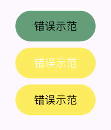
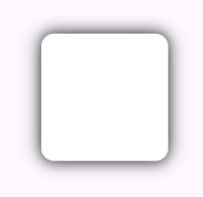
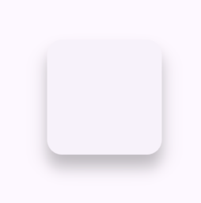
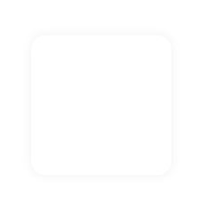
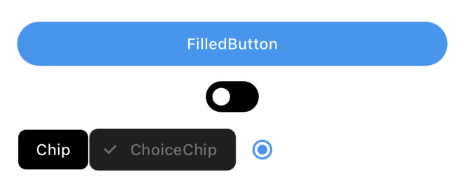

# Flutter 设计百科全书
## 主题、样式、颜色篇

## 前言
这篇文章的部分内容我从来没有在互联网上看到过  
（至少中文互联网没有 > 😂）  
（至少百度搜不到 > 😂） 

> 点名批评  
> ”谁会在意这个，这个东西(颜色)没人注意到，就这样吧“  
> ”设计师（实习生）怎么设计，我就怎么做，最后不好看跟我前端没关系“  


## 本章内容
+ 颜色 Color
+ 主题 Theme
+ 样式 Style


## Color 颜色的设计
虽然这篇文章主要讲的是主题样式，但是颜色却是最先要注意的地方。

* 不要使用 饱和度（鲜艳）过高的颜色
* 注意使用 反色，使用 对比度高的 反色，设置文本颜色

    

前面2个按钮的问题显而易见，为什么第三个按钮也有问题？  
问题就是，不应该用黄色作为按钮的背景色。  

### 卡片阴影的设计
看看谷歌设计的最早的阴影设计,  
  

还有目前MD3的卡片质感，  
  

你都不能怪开发者为什么 使用 谷歌的规范，是这东西 真的 太low了。  
不是乱吹，国内设计圈虽然起步慢，抄袭也多，但是不得不说，  
目前比欧美的 大圆角设计 真的 好太多了。

> 咱们是顶尖的上限不够高，但是平均水平比国外强太多

+ 目前大陆的设计圈，开始流行去阴影化，或弱阴影化
+ 我记得看到别人说过的话，如果用户注意到阴影了，那么你的阴影就是失败的设计。
+ 大陆的阴影设计 都是垂直投影，一般不会有XY轴偏移，如果你使用谷歌Card组件，用户会非常容易注意到差异。

### 弱阴影设计思路
弱化阴影的设计，最终效果就是，让你的阴影没那么突兀，  
可以将投影的颜色设置为无限接近于#FFFFFFFF,  
常见参考值 可以使 EE,FE,EF 等，235-245 区间。  
范围可以控制在 5-10px像素  
  
```DART
BoxDecoration(
            color: Colors.white,
            borderRadius: BorderRadius.circular(10),
            boxShadow: const [
              BoxShadow(
                color: Color(0xFFEFEFEF),
                blurRadius: 5,
                blurStyle: BlurStyle.outer,
              ),
            ],
          ),
```

### 去阴影设计思路
越来越多的设计 使用“无边界”，“无卡片”，“无阴影” 的设计。  
这种设计 非常的简洁，非常考验 布局能力。  
做法就是 使用背景色和卡片 色差，产生阶梯感。  
  
```DART
backgroundColor: const Color(0xFFFAFAFA), //背景白色偏灰
color: Colors.white, // 卡片白色
```


## Theme 主题设计
谷歌的MD设计其实只考虑了很多的按钮和配色，  
但是他们没想到，国内的设计师，设计一个程序时，  
能搞10几种按钮 和 文字 大小颜色 😂  
谷歌都气炸了。  

所以在中文互联网上，你搜索Flutter 主题时，这块的内容多数是复制粘贴党，  
并不是批评 到处复制粘贴的人，只是这种行为 让真正有个人理解的内容 更难被人看到。  

### 谷歌的主题设计
在MaterialApp下面有常用的三个主题相关字段，  
theme：白色主题  
darkTheme：黑色主题  
themeMode：主题模式  
```DART
enum ThemeMode {
  system,// 跟随系统变化
  light,// 强制白色主题
  dark,// 强制黑色主题
}
```
初始代码默认只设置了theme，不设置darkTheme，任何时候都不能切换到黑色模式，始终会显示白色主题。  
当设置为system模式时，系统主题切换，App会跟随系统变化，这是一个比较优秀的做法。

MaterialApp的theme，是ThemeData，其中的ColorScheme，是Flutter 中的颜色配置信息，
默认拥有ColorScheme.light,ColorScheme.dark,ColorScheme.fromSeed,三种快速配置，比较适合不在意颜色的APP快速使用。

> 推荐白色主题使用 ColorScheme.light  
> 推荐黑色主题使用 ColorScheme.dark

### Brightness 全解析(部分机翻)
```DART
enum Brightness {
  /// 例如，颜色可能是深灰色，需要白色文本。
  dark,
  /// 例如，颜色可能是亮白色，需要黑色文本
  light,
}
```
Flutter中黑白相关的区分,都可以使用Brightness，
但是需要注意的是，有些地方Brightness可能是相反并且反直觉的。
比如在系统顶部状态栏中的Brightness和IconBrightness就是一个容易搞混的设置
```DART
SystemUiOverlayStyle(
  statusBarBrightness: Brightness.light,//状态栏的主题
  statusBarIconBrightness: Brightness.dark,//状态栏的图标主题，需要跟状态栏主题相反
)
```

### 关于 ColorScheme
+ brightness 当前主题的类型
+ primary 主要颜色
+ onPrimary 在主要颜色上面的颜色
+ secondary 次要颜色
+ onSecondary 在次要颜色上面的颜色
+ error 错误的颜色
+ onError 在错误颜色上面的颜色
+ surface 表面颜色
+ onSurface 在表面颜色上面的颜色
+ inverse 关键字：颜色反转，一般用于反色

默认的颜色设计这块，如果严格按照这种规范来，  
程序中 只会有 几种颜色，

Flutter 颜色设置名称非常多 非常容易 搞迷糊。
> 如果你的程序颜色配置较少可以使用上面的关键字。
> 如果你的程序颜色配置较多，推荐使用ThemeData 的 extensions属性，类型为 ThemeExtension<dynamic>

我们先来讲默认的颜色配置，如果想看扩展主题，请跳到下方扩展主题章节。  
我们来设计一套兼容黑白主题的主题吧，这是一个最简单的按钮。  

我们先给MaterialApp定义一个白色主题theme.  
如果我们定义appBarTheme，代表App会在白色主题下 使用这个Appbar的主题设置。  
同样的，如果我们在darkTheme中定义appBarTheme，那么黑色主题会使用它。
```DART
    return MaterialApp(
      title: 'Flutter Demo',
      theme: ThemeData(
        appBarTheme: const AppBarTheme(
          backgroundColor: Colors.white,
          foregroundColor: Colors.black,
          elevation: 0,
          scrolledUnderElevation: 0,
          surfaceTintColor: Colors.black,
          systemOverlayStyle: SystemUiOverlayStyle(
              statusBarColor: Colors.transparent,
              statusBarBrightness: Brightness.light,
              statusBarIconBrightness: Brightness.dark,
              systemNavigationBarColor: Colors.white,
              systemNavigationBarDividerColor: Colors.black,
            ),
        ),
```

接着是颜色配置
```DART
colorScheme: const ColorScheme(
    brightness: Brightness.dark,
    primary: Colors.blue, // 主要颜色，一般是按钮上面会用
    onPrimary: Colors.white, // 在主要颜色 上面，就是文字的颜色，我们用白色
    secondary: Colors.grey, // 次要颜色，用灰色
    onSecondary: Colors.white,// 在次要颜色 上面，就是文字的颜色，我们用白色色
    error: Colors.red,//错误颜色
    onError: Colors.white,// 错误颜色上面的文字颜色
    surface: Colors.black, // 表面颜色
    onSurface: Colors.white,// 表面上的文字
),
```
到这里，已经完成了颜色配置，flutter默认的组件style都会从里面取出颜色使用  
```DART
          FilledButton(
            onPressed: () {},
            child: const Text("FilledButton"),
          ),
          Switch(
            value: false,
            onChanged: (value) {},
          ),
          Row(
            children: [
              const Chip(
                label: Text("Chip"),
              ),
              const ChoiceChip(label: Text("ChoiceChip"), selected: true),
              Radio(
                value: 1,
                groupValue: 1,
                onChanged: (value) {},
              )
            ],
          )
```
效果如下：

   

当然我们也可以直接取到这个颜色值使用。
```DART
Theme.of(context).colorScheme.primary
```

> 如何使用主题的颜色完成自定义样式的组件呢？ ->  具体使用方法查看本章Style模块，   

从上面的内容上你也看出来了，如果你的程序 颜色 非常单一，谷歌这套设计也是能够满足需求的，  
可惜国内的设计环境就不是这样，各种颜色，各种尺寸，  
这里有3种方案，  
第一种是 跟设计师商量，减少 部分颜色 和 样式设计，其实 一个App种 按钮大概就是 2-3种 ，文字颜色 也是 2-3 种。
第二种是 全局静态Style  
    在静态类中，写固定函数，返回固定组件的样式和颜色，比如定义一个 BlackButton，在函数中申明它的背景色为黑色。这种做法它的缺陷就是无法跟随主题变化，如果你的程序只有一种主题，那么它也是一种可行的方案。
第三种是 使用扩展 ThemeExtension，查看下方。

### 扩展主题设计 ThemeExtension
```DART
class DiyTheme extends ThemeExtension<DiyTheme> {
  const DiyTheme({
    required this.brandColor,
    required this.danger,
    required this.dangerTextStyle,
  });

  final Color? brandColor;
  final Color? danger;
  final TextStyle? dangerTextStyle;

  @override
  DiyTheme copyWith({Color? brandColor, Color? danger}) {
    return DiyTheme(
      brandColor: brandColor ?? this.brandColor,
      danger: danger ?? this.danger,
      dangerTextStyle : dangerTextStyle ?? this.dangerTextStyle,
    );
  }

  @override
  DiyTheme lerp(DiyTheme? other, double t) {
    if (other is! DiyTheme) {
      return this;
    }
    return DiyTheme(
      brandColor: Color.lerp(brandColor, other.brandColor, t),
      danger: Color.lerp(danger, other.danger, t),
      dangerTextStyle : *** 省略,
    );
  }

  @override
  String toString() => 'DiyTheme(brandColor: $brandColor, danger: $danger)';
}

//创建方式
theme: ThemeData.light().copyWith(
        extensions: <ThemeExtension<dynamic>>[
          const DiyTheme(
            brandColor: Color(0xFF1E88E5),
            danger: Color(0xFFE53935),
            dangerTextStyle : *** 省略
          ),
        ],
      ),

//使用方式
final DiyTheme diy = Theme.of(context).extension<DiyTheme>()!;
diy.brandColor
diy.dangerTextStyle
```
## Style 样式的设计
需要好好区分一下 Theme 和 Style  
在flutter中，主题是一些列style的组合。  
所以 并不是 你在 互联网 上搜到的 那种换一个 颜色 就是一个主题。  
我要 讲的内容是主题跟样式的更优做法。  

学会让style从theme中获取颜色和配置。


### ButtonStyle 如何设计和使用

### TextStyle 如何设计和使用

+ textSize
+ color

### 其他组件的Style 如何设计和使用