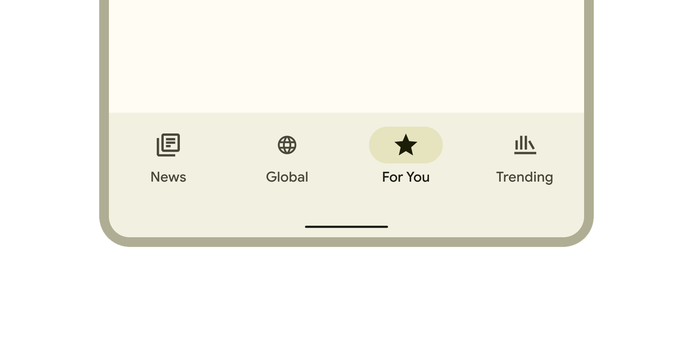
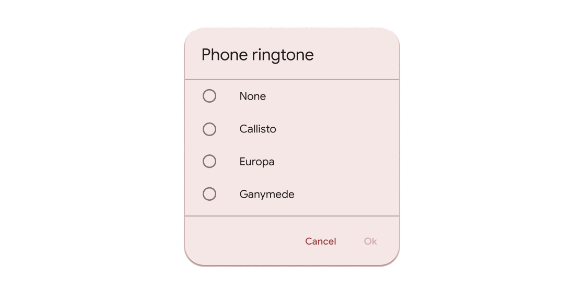
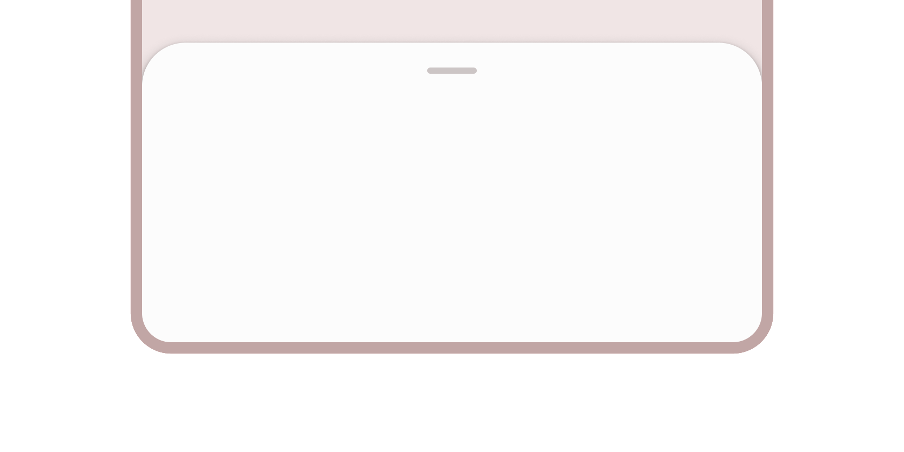

# Flutter 设计百科全书

## 布局规范篇

## 前言

其实我是有点鄙视那些人，他们说。

> ”界面写的好看有什么用，你要把后面的逻辑代码写好了才是本事“

> ”界面写得好没用，用户只在乎功能和稳定“

需要解释的几个点就是：

*   界面写的好看，不代表功能不稳定、
*   好看的界面不是花里胡哨，而是简洁大方。

本章会介绍各类常用的尺寸设计，以及布局思路。\
本章部分内容跟flutter\_screenutil自适应尺寸无关，学习的是思路，而不是具体的数值。

## 本章内容

*   AppBar
*   Body
*   BottomBar
*   Button、IconButton、以及Icon的尺寸设计
*   Dialog
*   BottomSheet
*   List
*   Row、Column
*   Container、Padding
*   Stack、IndexedStack
*   总结

### AppBar 相关的设计指南

AppBar 其实是2个部分组成，上方是StatusBar 状态栏，由系统控制高度\
下方是ToolBar，Flutter 定义了一部分 尺寸常量，比如toolbar的默认高度kToolbarHeight = 56，\
其他常用参数你可以从下面文件找到:

> flutter/packages/flutter/lib/src/material/constants.dart

```DART
/// 手指交互尺寸
const double kMinInteractiveDimension = 48.0;

/// [AppBar] toolbar 默认高度
const double kToolbarHeight = 56.0;

/// 底部导航栏 bar 高度
const double kBottomNavigationBarHeight = 56.0;

/// 默认的水波纹圆角值
const double kRadialReactionRadius = 20.0;

/// Tab 选项卡水平内边距
const EdgeInsets kTabLabelPadding = EdgeInsets.symmetric(horizontal: 16.0);

/// 列表子项的内边距
const EdgeInsets kMaterialListPadding = EdgeInsets.symmetric(vertical: 8.0);

// 默认亮色图标的颜色
final Color kDefaultIconLightColor = Color(0xFFFFFFFF);

// 默认暗色图标的颜色
final Color kDefaultIconDarkColor = Color(0xDD000000);
```


Appbar 包含三个区域，按照设计规范来说，
左侧leading 的触控极限应该是48\*48，
右侧Action是一个组件数组，如果你放入交互按钮，应该 增加右侧 5-15 的边距，这样按钮才不会太贴边\
如果你增加的按钮是没有内边距的，你需要将边距设置为10甚至15。\
IconButton默认是有内边距的，如果增加10的边距，就会特别空，所以可以考虑使用5。\
（ps:设置action之后，title不会居中了，记得根据软件的设计风格 设置centerTitle）

```DART
/// action区域的右侧边距设计
actions: [
   Button(
        onPressed: () {
           _showPushAction();
        },
        child: Image.asset(
           "assets/images/photo.png",
           width: 24,
           height: 24,
       ),
    ),
    5.horizontalSpace,//增加5-15个尺寸的边距
],
```

多个IconButton放入action，并不会特别难看，但是你放入多个自定义按钮，可能就会特别挤 或者 特别空，考虑增加它们之间的间距 工具栏看起来更舒服。
（关于自定义按钮尺寸和Icon尺寸请看下方章节细节解析）

### Body 身体部分 常用设计参考

作为页面中最常见的区域，body一般需要考虑 内边距和安全区域，

*   页面整体内边距\
    一般body的内边距考虑设计成四边 10 - 20 的内边距，\
    如果你的页面是List列表类型，建议是给List增加内边距，
    如果你使用了extendBodyBehindAppBar，修改ListView的Padding会导致ListView默认的SafePadding失效，你需要配合ViewPadding来避免安全区域。

*   Item的尺寸和内边距设计\
    参考谷歌给MD定义的触控尺寸为48px，那么Item大概率是比48px高一些的

> Item的 水平间距建议设计为 15 - 20px ，上下间距 建议设计为 10px - 20px。
> 不建议给Item设定固定的高度，而是让Item自适应高度，除非你能准确的计算内部高度，不然会出现布局溢出情况。(itemExtent设置后据说会提升性能？)

### BottomBar



BottomBar 的默认高度也是56(存疑),\
这个参数一般不建议修改，比如使用BottomAppBar时，建议使用自适应高度，而不是固定尺寸。\
底部一般有三个可用组件

*   BottomAppBar 底部AppBar 一般用于放置导航，实现自定义的导航效果。
*   BottomNavigationBar 底部导航栏，效果比较固定，没有特殊需求可以使用。不太方便修改高度。
*   NavigationBar 底部导航栏，应该是MD3的设计风格，特别大。

### Button、IconButton、以及Icon的尺寸设计

谷歌从很早开始就在MD设计中申明，手指触碰区域 是48px，
所以按钮的点击区域大概围绕这个参数设计。\
大多数按钮文字 都是 12-14px，所以按钮的上下边距大概是 15px - 20px，\
大多数时候Icon 被设计成几个 固定值，\
当它与文字并排时，大概是 10-16px的size，\
当它作为按钮图标是，大多数时候是 24px 28px 32px

### Dialog




Dialog 弹窗一般设计都是固定宽高的，\
这时候需要注意极限宽高的设计，部分小屏幕手机，宽度可能低于320像素，高度低于500像素，
如果使用固定宽高的尺寸设计，可能会出现溢出警告。\
弹窗部分的尺寸设计，尽量使用最小化尺寸设计，也就是内容+边距的设计思路。\
建议使用ConstrainedBox设置一个最小值240，内部边距参考20px，让整个弹窗自适应高宽。\
官方的Dialog 就是限制的最小宽度

```DART
constraints: const BoxConstraints(minWidth: 280.0),
```

### BottomSheet



BottomSheet 底部弹出层，可以考虑 设计为屏幕的百分比高度。例如30% 50% 60-70%\
可以使用固定像素值，建议不要超过 450px。

```DART
MediaQuery.of(context).size
```
使用size可以拿到屏幕的尺寸

### List

```DART
MediaQuery.of(context).viewPadding.top
MediaQuery.of(context).viewPadding.bottom
```

通过mediaquery可以拿到屏幕安全区域的尺寸，通过在List上下设置，可以让List避开非显示区域。\
查看ListView内部安全区域实现代码，看看官方怎么实现的。

```DART
final MediaQueryData? mediaQuery = MediaQuery.maybeOf(context);
      if (mediaQuery != null) {
        // Automatically pad sliver with padding from MediaQuery.
        final EdgeInsets mediaQueryHorizontalPadding =
            mediaQuery.padding.copyWith(top: 0.0, bottom: 0.0);
        final EdgeInsets mediaQueryVerticalPadding =
            mediaQuery.padding.copyWith(left: 0.0, right: 0.0);
        // Consume the main axis padding with SliverPadding.
        effectivePadding = scrollDirection == Axis.vertical
            ? mediaQueryVerticalPadding
            : mediaQueryHorizontalPadding;
        // Leave behind the cross axis padding.
        sliver = MediaQuery(
          data: mediaQuery.copyWith(
            padding: scrollDirection == Axis.vertical
                ? mediaQueryHorizontalPadding
                : mediaQueryVerticalPadding,
          ),
          child: sliver,
        );
      }
```
当你为ListView设置Padding时，就把safearea功能给覆盖了，
你可以参考上面的代码，自己再实现它。

ListTile 作为快速演示效果组件,非常不错，\
但是推荐自己用更简单的Row组件实现它，因为你自己写的结构会更简单，也更轻量化。

> 我见过SingleChildScrollView + Column实现滚动效果的。\
> 我更推荐使用ListView(children: \[])

### Row、Column

最近的Flutter SDK 3.27+ 增加了 spacing 作为间隔\
在之前的版本使用SizedBox 作为间隔

如果能使用

*   mainAxisAlignment
*   crossAxisAlignment

实现的对齐或者排序方式，优先考虑，而不是使用Spacer

*   mainAxisSize 可以设置Row Column的高度 或 宽度

### Container、Padding

大多数时候如果仅有边距需求，优先选择Padding组件。
大多数时候，padding 应该在最外层

```DART
Padding(
  padding: EdgeInsets.all(10),
     child: Row(),
```

### Stack、IndexedStack

Stack 堆叠布局，一般用于多个组件叠放，\
使用fit: StackFit.expand 铺满父容器，而不是用double.infinity 再次😀。

## 总结

*   AppBar 右侧按钮记得加边距 5-10px
*   ListView注意上下边距
*   ListItem注意上下边距 10px ，左右边距20px，最终让单行Item的高度在48px-70px之间
*   body 如果没有使用列表，注意内边距20px
*   bottom 注意safearea
*   弹出层 宽度最好不要超过320px，高度不要超过 450px
*   减少层级 优化代码 是一直要做的事情。
