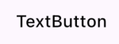
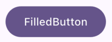
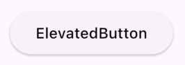
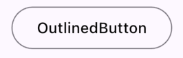
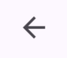

## Flutter 设计 - 百科全书 - 按钮

### 其他文章
+

### 本章内容
> InkWell 和 GestureDetector 如何自定义按钮

> 常用 Button

> ButtonTheme 和 按钮自定义样式

## 如何自定义按钮 InkWell 和 GestureDetector 
* 如果你需要给 自定义组件增加 点击事件, 请使用 GestureDetector
* 如果你需要给 这个组件增加 水波纹涟漪效果, 请使用 InkWell
* GestureDetector 的 behavior,推荐设置为 HitTestBehavior.opaque。
* InkWell内部自带GestureDetector，所以GestureDetector性能消耗更小。

* 不建议使用GestureDetector来代替传统按钮，而是修改默认Button的Style来完成自己的需求：

## 常用的按钮：
### TextButton

纯文字的按钮，默认是有内边距的(不推荐 GestureDetector + Text 实现)
  
### FilledButton

(不推荐 GestureDetector + Container + Text 实现)

### ElevatedButton

比FilledButton增了一个高度elevation，不推荐使用，除非你要实现MD设计风格。

### OutlinedButton

外边框按钮，外面一条线。

### IconButton

自定义图标按钮 推荐 IconButton + Image(svg等)
(不推荐 GestureDetector + Image 实现，除非你的贴图自带Padding)

## ButtonTheme 和 按钮自定义样式
在