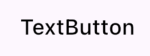
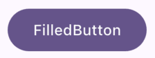
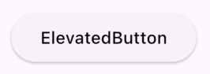
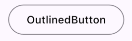
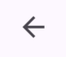

# Flutter 设计百科全书
## 按钮篇

## 前言
本章内容需要结合我其他Theme相关文章观看。  
自定义按钮需要考虑手指触控面积和透明穿透设置。

## 本章内容
+ InkWell 和 GestureDetector 如何自定义按钮
+ 图标按钮案例
+ 图片按钮案例
+ 常用 Button
+ ButtonTheme 和 按钮自定义样式
+ WidgetStateProperty


## 如何自定义按钮 InkWell 和 GestureDetector 
* 如果你需要给 自定义组件增加 点击事件, 请使用 GestureDetector
* 如果你需要给 这个组件增加 水波纹涟漪效果, 请使用 InkWell
* InkWell 需要在Ink 或者 Material 中才能正常工作。
* GestureDetector 的 behavior,推荐设置为 HitTestBehavior.opaque。
* InkWell内部自带GestureDetector，所以GestureDetector性能消耗更小。
* 不建议使用GestureDetector来代替传统按钮，而是修改默认Button的Style来完成。
* 建议给GestureDetector增加Padding组件增加触控面积。

```DART
GestureDetector(
  behavior: HitTestBehavior.opaque,
  onTap: () {
        
  },
  child: const Padding(
     padding: EdgeInsets.all(8.0),
     child: Text("手势捕获"),
  ),
);

///机器翻译
///如何在命中测试中表现。
enum HitTestBehavior {
///尊重孩子的目标会在自己的范围内接受事件
///只有当他们的一个孩子被命中测试击中时。
  deferToChild,

///不透明的目标可以被命中测试击中，导致它们都受到
///事件在其范围内，并防止其背后的目标从视觉上
///也接收事件。
  opaque,

///半透明目标都在其范围内接收事件并允许
///他们身后的目标也可以接收事件。
  translucent,
}
```

## 图标素材按钮案例 - 仅供参考
```DART
IconButton(
   icon: Image.asset("图标.png"),
   onPressed: () {},
),
```

## 图片素材按钮案例 - 仅供参考
```DART
GestureDetector(
  behavior: HitTestBehavior.opaque,
  child: Image.asset("按钮.png"),
),
```

## 常用的按钮：
### TextButton


纯文字的按钮，默认是有内边距的(不推荐 GestureDetector + Text 实现)
  
### FilledButton


(不推荐使用 GestureDetector + Container + Text 实现)

### ElevatedButton


比FilledButton增了一个高度elevation，不推荐使用，除非你要实现MD设计风格。

### OutlinedButton


外边框按钮，外面一条线。

### IconButton


自定义图标按钮 推荐 IconButton + Image(svg等)
(不推荐使用 GestureDetector + Image 实现，除非你的贴图自带Padding)

## ButtonTheme 和 按钮自定义样式
Theme 和 ThemeData 请查看我另外的文章  

```DART
textButtonTheme: TextButtonThemeData(
    style: ButtonStyle(
        shape: 
        padding: 
        elevation: 
        minimumSize: 
        overlayColor: 
        foregroundColor: 
        backgroundColor: 
    )
)
```

> 常用属性(基本上每一种按钮都拥有这些属性，但是选择特性最符合你需求的按钮去修改样式能够事半功倍。)
* shape 形状可以定义按钮的形状，常用类型如下
```DART
// 五角星
StarBorder
// 圆型
CircleBorder
// 胶囊按钮
StadiumBorder 
// 圆角按钮
RoundedRectangleBorder(
    borderRadius: BorderRadius.circular(10)
)
```

* padding 按钮的内边距，可以设置为EdgeInsets.zero

* elevation 按钮的高度，估计只有ElevatedButton有效(存疑)

* minimumSize 按钮的最小体积，按钮都有一个默认值，如果你让按钮变得很小，那么你需要修改这个字段以及tapTargetSize字段，注意 按钮较小时，可能会导致内部Text无法 正常渲染。

* overlayColor 水波纹颜色

* foregroundColor 前景色，通过这个属性可以设置 按钮中的Text 颜色，而不是在每一个 Button的Text组件中设置 颜色。

* backgroundColor 背景色，设置按钮的背景色。

## WidgetStateProperty 组件状态
Flutter 中按钮都是具有状态的，在上方你尝试设置背景时，发现按钮竟然不能直接设置背景色，这是因为按钮背景色的设置处于一个多种状态的叠加态中，你可以参考下方来编写按钮样式设置。

```DART
backgroundColor: WidgetStateProperty.resolveWith((state){
    if (state.contains(WidgetState.disabled)) {
        return Colors.grey;
    }
    return Colors.blue;
})

/// 组件状态
enum WidgetState implements WidgetStatesConstraint {
  hovered,
  focused,
  pressed,
  dragged,
  selected,
  scrolledUnder,
  disabled,
  error;
}
```

除了按钮以为，其他组件也同样具有组件状态，大多数时候设置ThemeStyle都需要从此下手。  


## 本章结束，附上一个全局圆角按钮的实现参考。


```DART
FilledButton(
  style: ButtonStyle(
  shape: WidgetStatePropertyAll(
    RoundedRectangleBorder(
        borderRadius: BorderRadius.circular(10)
    ),
  ),
),
    onPressed: () {},
    child: Text("圆角按钮"),
),
``` 