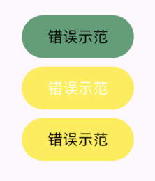

## Flutter 设计 - 百科全书 - 颜色

### 其他文章
+

### 本章内容
+ 颜色设计以及对比度
+ 常用 Button
+ ButtonTheme 和 按钮自定义样式

## 颜色设计以及对比度
#### 点名批评：
* #### UI写的好看有什么用，功能稳定最重要。
* #### 谁会在意这个，这个东西(颜色)没人注意到，就这样吧
* #### 设计师（实习生）怎么设计，我就怎么做，效果跟我前端没关系

## ColorScheme Flutter的颜色都在这
ThemeData中的ColorScheme，Flutter 中的颜色配置信息，
默认拥有ColorScheme.light,ColorScheme.dark,ColorScheme.fromSeed,三种快速配置，比较适合不在意颜色的APP快速使用。

> 推荐白色主题使用 ColorScheme.light
> 推荐黑色主题使用 ColorScheme.dark
* brightness 当前主题的类型
* primary 主要颜色
* onPrimary 在主要颜色上面的颜色
* secondary 次要颜色
* onSecondary 在次要颜色上面的颜色
* error 错误的颜色
* onError 在错误颜色上面的颜色
* surface 表面颜色
* onSurface 在表面颜色上面的颜色
* inverse 关键字：颜色反转，一般用于反色
  
Flutter 颜色设置名称非常多 非常容易 搞迷糊。
> 如果你的程序颜色配置较少可以使用上面的关键字。
> 如果你的程序颜色配置较多，推荐使用ThemeData 的 extensions属性，类型为 ThemeExtension<dynamic>

颜色的设计原则：
* 不要使用 饱和度（鲜艳）过高的颜色
* 注意使用 反色原则来设置文本颜色

