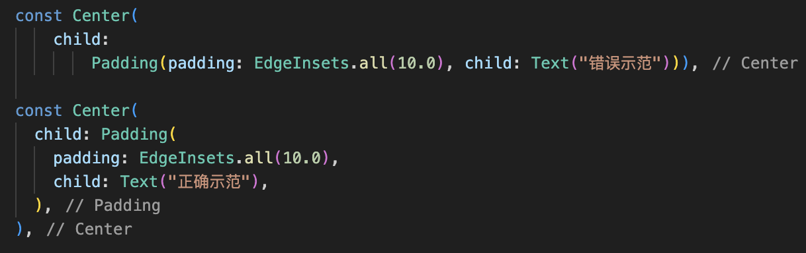

# Flutter 设计百科全书
## 语法和代码规范篇

### Dart代码格式建议
* 请给组件增加 const
    ```DART
    const SizedBox()
    ```

* 请尽量将属性字段超过2个的逗号补全，增加 代码的可阅读性！！！！
    


* 颜色优先使用16进制表达式
    ```DART
    Color(0xFF336699)
    ```

* 不要在行内进行复杂运算（固定常量区别不大，它会在编译时被提前运算保存结果）
    ```DART
    SizedBox(height: 3.1415926 * pi)
    ```

* 尽量不要使用的属性
    ```DART
    double.infinity
    ```
    一般情况下是不需要明文使用double.infinity的，
    常见的可能会设置double.infinity的情况
    > body 的组件无法铺满，使用SizedBox.expand铺满（内部是double.infinity）

    > Column 无法铺满，设置crossAxisAlignment:CrossAxisAlignment.stretch 左右铺满

    > Row 无法铺满，设置crossAxisAlignment:CrossAxisAlignment.stretch 上下铺满

* 不要滥用的属性
    ```DART
    SafaArea
    ```
    多数情况下，在安卓设计中，沉浸式状态栏都是一种非常漂亮的设计，
    如果错误的使用SafeArea会丢失这种效果，
    并且有时候SafeArea会导致无法预料的布局，所以谨慎使用。